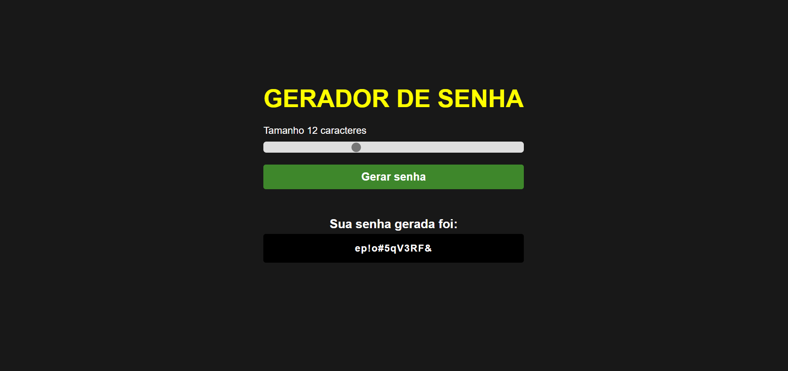

Gerador de Senha
!NPM

Sobre o projeto
Este repositório foi criado para colocar em prática os conhecimentos adquiridos nos cursos de HTML, CSS e Javascript do <b>Sujeito programador</b> de um projeto <b>Frontend Web</b>.

O objetivo do projeto foi recriar a interface de um gerador de senhas utilizando tecnologias simples como <b>HTML5, CSS3 e JavaScript</b>, além de englobar os conceitos de: como estruturar um layout, técnicas de CSS3 com containers e variáveis, como posicionar os elementos com Flexbox.

Layout do projeto
WEB

MOBILE

Tecnologias utilizadas
HTML
CSS
Javascript
Fontawesome
Google Fonts
Autor
<b>Marcelo da Silva Belitardo Junior</b>

Linkedin: https://www.linkedin.com/in/marcelo-junior-59498210a/

email: msbcontjr@outlook.com